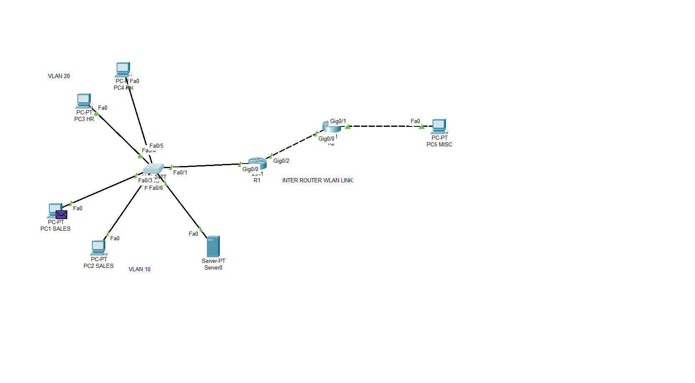

# Self-Built Enterprise Network — VLANs, Routing & Segmentation

A small multi-site network I designed and built from scratch in Cisco Packet Tracer, covering
IP addressing, VLAN segmentation, trunking, routing (static and dynamic), DHCP, DNS, and
access control — the foundational protocols behind most enterprise networks.

## What this demonstrates
- Designing an IP addressing scheme from real-world host requirements (VLSM)
- Segmenting a network into VLANs and configuring trunking between switches and routers
- Configuring inter-VLAN routing (router-on-a-stick), plus both static and dynamic (OSPF) routing
  between two sites
- Automatic IP assignment via DHCP, and name resolution via a DNS server
- Writing and applying an Extended ACL to enforce a segmentation policy, including a targeted
  exception and an understanding of ACL statelessness
- Verifying and troubleshooting configuration issues using `show` commands and Packet Tracer's
  Simulation Mode

## Topology

- **R1** — local site router, router-on-a-stick for VLAN 10 (Sales) and VLAN 20 (HR)
- **SW1** — access switch, trunked to R1
- **R2** — remote site router, connected to R1 via a point-to-point WAN link

## IP Addressing
Designed using VLSM to avoid wasting address space across departments of different sizes.
Full subnet table and allocation logic: [ip-addressing.md](addressing-scheme.md).

| Subnet | Purpose | Mask |
|---|---|---|
| 192.168.10.0/26 | Sales (VLAN 10) | /26 |
| 192.168.10.64/27 | HR (VLAN 20) | /27 |
| 192.168.10.96/30 | R1–R2 WAN link | /30 |

## Routing
Static routes were configured first between R1 and R2 and verified working, then OSPF was
configured and confirmed to provide the same connectivity automatically — at which point the
static routes were removed, leaving OSPF as the sole routing mechanism between sites.

## DHCP & DNS
- DHCP is configured and verified working on the **Sales** VLAN — PCs receive an address,
  gateway, and DNS server automatically.
- A DNS server was added to the topology and resolves `websrv.company.local`, confirmed via a
  successful ping to the hostname.
- DHCP was also configured for the **HR** VLAN, but a client-side issue prevented
  successful lease assignment during testing. HR currently uses static addressing as
  a result — noted here rather than glossed over, since verifying and being honest about what
  actually works is part of the exercise.

## Access Control
An Extended ACL is applied on HR's sub-interface, inbound, implementing: HR
is blocked from reaching Sales in general, with two deliberate exceptions — access to the
shared DNS server, and ICMP echo-replies (needed because ACLs are stateless and don't
automatically permit return traffic for connections Sales itself initiated). Full reasoning
and command-by-command explanation: [configuration-walkthrough.md](walkthrough.md).

## Configuration
Full running-configs for each device: [configs/](configs/).

## Explore the Lab Yourself
The complete Packet Tracer file is included — open `enterprise-network-lab.pkt` in Cisco
Packet Tracer to explore the topology directly, inspect device configs live, run your own
pings, or step through traffic in Simulation Mode.

## Roadmap
- [x] VLSM-based IP addressing
- [x] VLAN segmentation and trunking
- [x] Static inter-site routing
- [x] OSPF (dynamic routing, replacing static routes)
- [x] DHCP (Sales VLAN) + basic DNS resolution
- [x] Extended ACL with targeted exceptions
